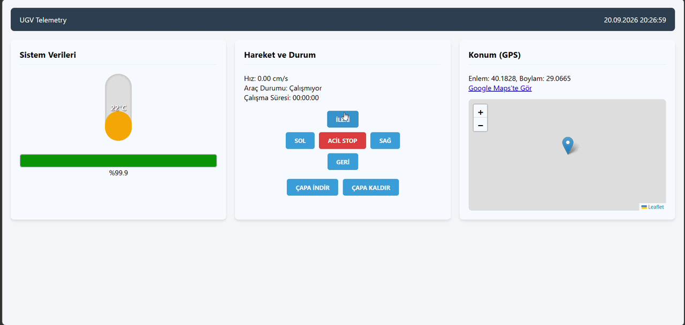

# Autonomous UGV Telemetry & Edge Control Dashboard



##  Project Overview
This project is a real-time **Human-Machine Interface (HMI) / Telemetry Dashboard** designed for Unmanned Ground Vehicles (UGVs). Developed as part of an autonomous systems initiative, it allows operators to monitor critical vehicle parameters, track GPS locations dynamically, and send edge-control commands seamlessly without page reloads.

The architecture separates the frontend presentation layer from the backend telemetry simulation, demonstrating a modern, asynchronous approach to industrial system integration.

##  Key Features
*   **Real-Time Telemetry:** Live monitoring of battery levels, motor temperatures, and velocity.
*   **Asynchronous Data Fetching:** Utilizes JavaScript `Fetch API` to pull sensor data continuously via REST API endpoints, updating the DOM dynamically.
*   **Dynamic GPS Tracking:** Integrates `Leaflet.js` to visualize the UGV's real-time geographic coordinates.
*   **Edge Command Interface:** Dedicated control panel to dispatch movement and functional commands directly to the vehicle control unit.
*   **Simulated Backend:** Includes a lightweight Python (Flask) server acting as a "Digital Twin" telemetry generator. It mimics real-world hardware behavior (temperature rise during movement, battery drain, smooth S-Curve acceleration, and braking) for testing and demonstration purposes.

##  System Architecture & Technologies

The system is built on a decoupled architecture, simulating a typical edge computing environment where hardware sensors communicate with a localized server, which then feeds a web-based dashboard.

*   **Frontend (HMI):** HTML5, Vanilla JavaScript, Custom CSS Grid (Responsive)
*   **Backend (Telemetry Server):** Python, Flask, Flask-CORS
*   **Mapping:** Leaflet.js (OpenStreetMap)

**Note on GPS & Mapping Simulation:** The real-time coordinate data stream (Lat/Lon) displayed on the dashboard is generated locally via the Python simulation engine based on the vehicle's dynamic velocity. However, rendering the visual map tiles requires an active API Key from a third-party mapping provider. While the map visuals may appear restricted (Access Blocked) in the standalone public demo due to API usage policies, the backend telemetry data stream remains fully functional.

##  How to Run Locally

1.  **Clone the repository:**
    ```bash
    git clone [https://github.com/borayce/ugv-interface.git](https://github.com/borayce/ugv-interface.git)
    cd ugv-interface
    ```
2.  **Install backend dependencies:**
    ```bash
    pip install flask flask-cors
    ```
3.  **Start the telemetry server:**
    ```bash
    python backend.py
    ```
    *(The server will start running on `http://127.0.0.1:5000`)*
4.  **Launch the Dashboard:**
    Open the `index.html` file in any modern web browser. The dashboard will automatically connect to the local server and begin live data streaming.
